# IT Applications Assignment  
## Market Segmentation in the Global Video Game Industry

**Student:** Boda Pooja  
**Section:** B  
**Roll Number:** IPM06091  
**Instructor:** Dr. Karan Verma  

---

# Problem Statement

The global video game industry is one of the fastest-growing entertainment industries, generating billions of dollars annually. Thousands of games are released across different platforms and genres every year.

However, understanding **why some games succeed globally while others perform well only in specific regions** is a major challenge for game developers and publishers.

Companies need to understand:

- Which genres generate the highest global demand  
- Which platforms dominate the gaming market  
- How player preferences differ across regions such as North America, Europe, and Japan  
- Whether different types of games form natural market segments

This project analyzes global video game sales data to uncover patterns in the gaming market and identify hidden segments of games based on their sales behavior.

---

# Dataset Description

The dataset contains global video game sales information including:

- Game Name  
- Platform  
- Genre  
- Publisher  
- North America Sales  
- Europe Sales  
- Japan Sales  
- Global Sales  

This data allows us to analyze how different factors influence the success of video games in different parts of the world.

---

# Genre Trends in the Gaming Industry

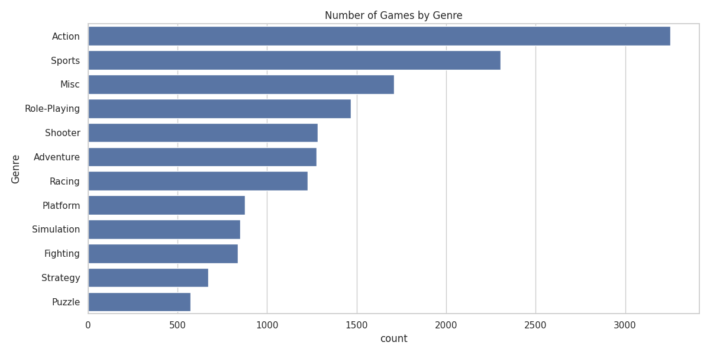

The genre distribution shows the number of games released in each category.

**Insight:**  
Action, Sports, and Misc genres appear most frequently in the industry, indicating strong developer focus on these categories.

---

# Global Sales Performance by Genre

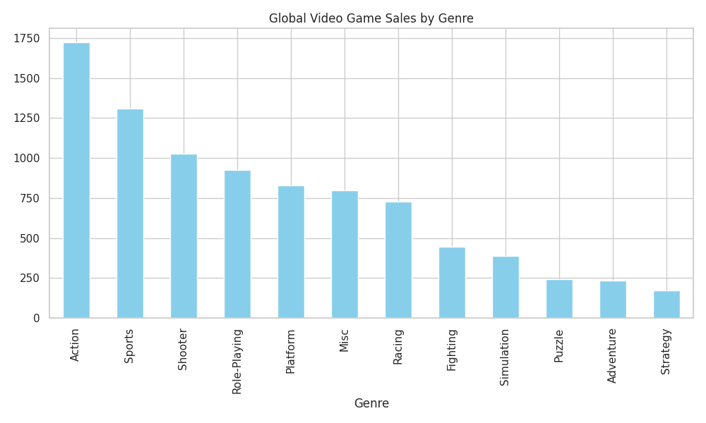

This visualization highlights how much revenue different genres generate globally.

**Insight:**  
Some genres generate significantly higher global revenue, suggesting stronger player demand and market popularity.

---

# Platform Market Leaders

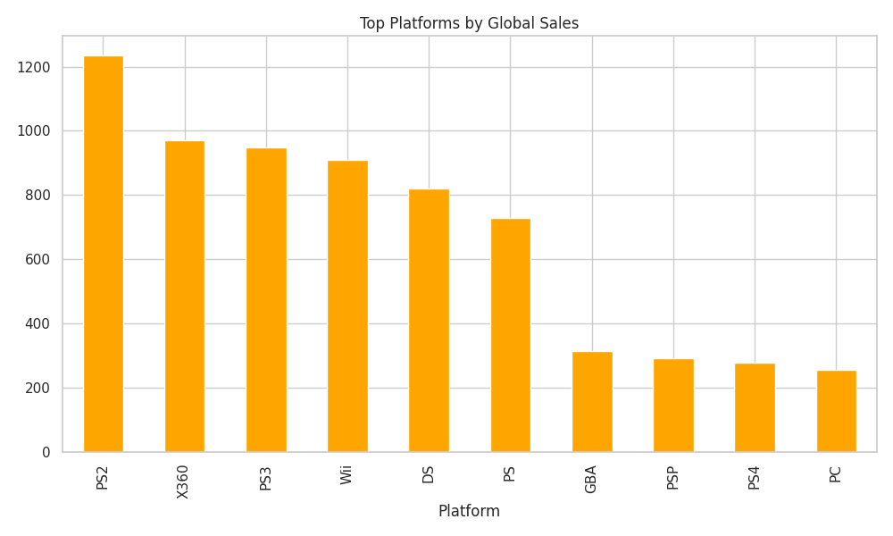

Different gaming platforms contribute differently to the global market.

**Insight:**  
Certain platforms dominate global game sales, showing how hardware ecosystems influence game success.

---

# Regional Gaming Preferences

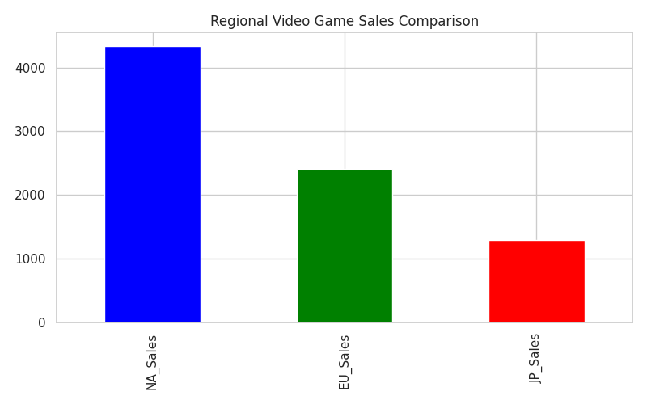

This chart compares total game sales across major gaming regions.

**Insight:**  
North America and Europe display similar market behavior, while Japan shows unique gaming preferences.

---

# Relationship Between Regional Markets

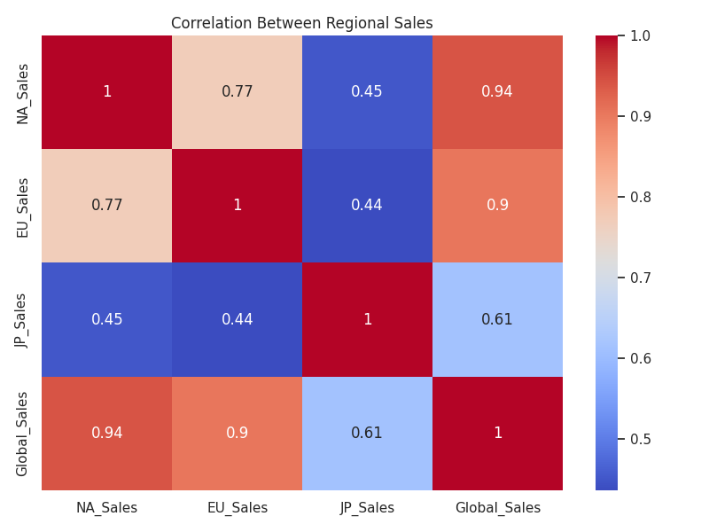

The correlation heatmap reveals relationships between regional sales.

**Insight:**  
Sales in North America and Europe are highly correlated, meaning games popular in one region tend to perform well in the other.

---

# Market Pattern Exploration

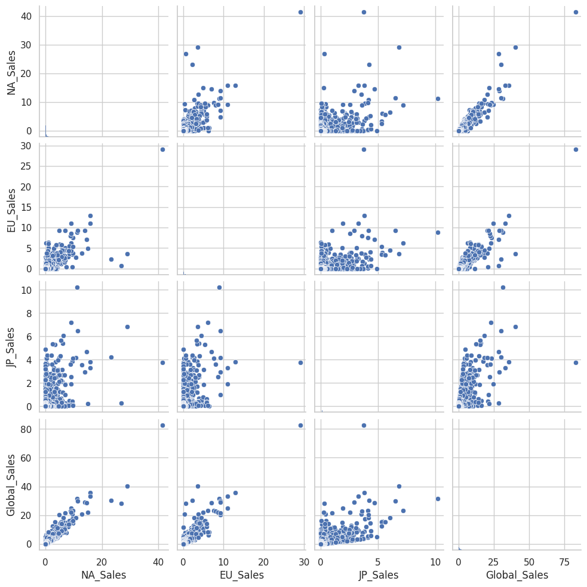

The pairplot visualizes relationships between sales variables across regions.

**Insight:**  
This helps identify patterns in how games perform across multiple global markets.

---

# Identifying Market Structure

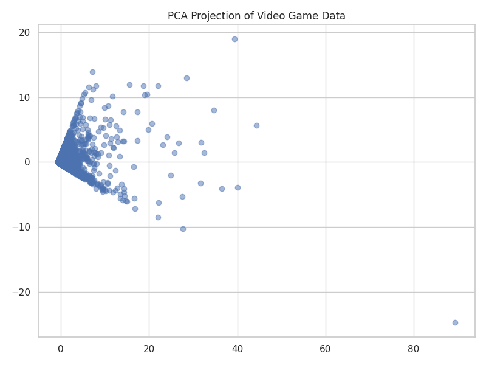

To better visualize the structure of the market, dimensionality reduction is used to simplify the dataset while preserving important patterns.

**Insight:**  
The transformed data helps reveal hidden groupings of games based on sales behavior.

---

# Determining Market Segments

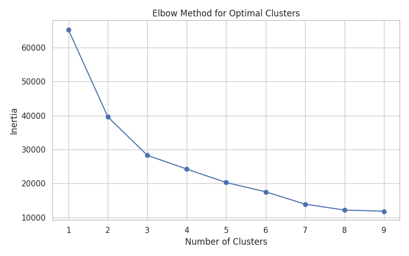

This method helps determine the appropriate number of segments in the gaming market.

---

# Game Market Segmentation

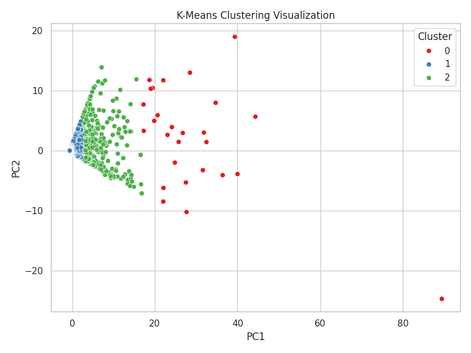

Games are grouped into clusters based on similarities in regional sales performance.

**Insight:**  
Different clusters represent different types of games, such as globally successful titles, region-specific games, and moderately performing games.

---

# Comparing Market Segments

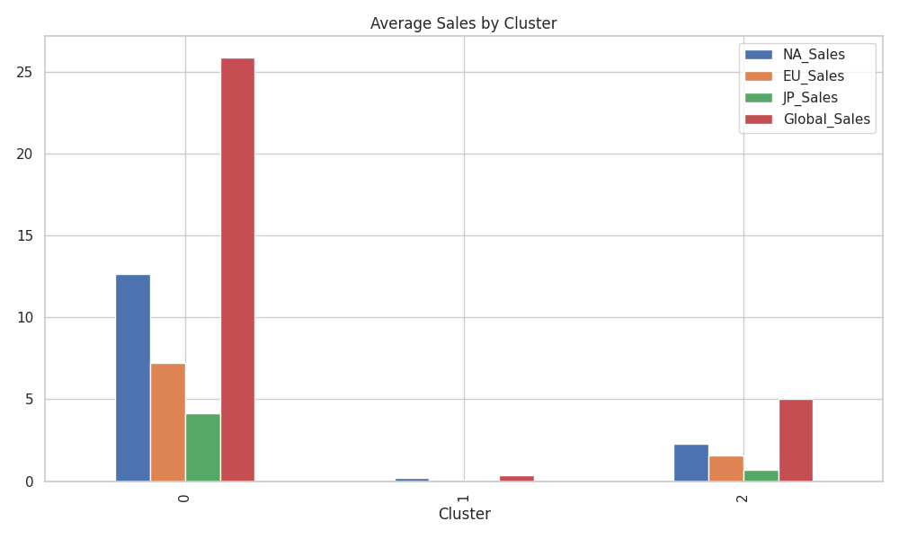

This comparison highlights how each cluster differs in terms of regional sales.

---

# Major Publishers in the Gaming Industry

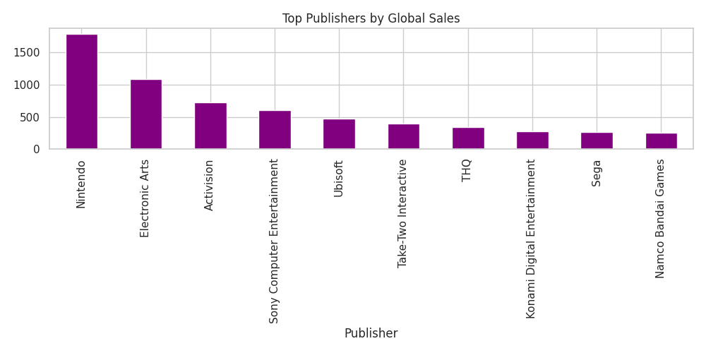

Publisher analysis reveals which companies dominate the gaming market.

**Insight:**  
A small number of publishers account for a significant portion of global video game sales.

---

# Tools Used

- Python  
- Pandas  
- NumPy  
- Scikit-learn  
- Matplotlib  
- Seaborn  
- Google Colab  
- GitHub  

---

# Conclusion

The analysis highlights several important trends in the global gaming industry.

- Certain genres dominate both game releases and revenue generation  
- Some platforms generate significantly higher sales than others  
- Regional preferences vary across global markets  
- Games naturally form different market segments based on sales behavior

These insights demonstrate how data analysis can help understand the structure of the video game market and support better strategic decisions for developers and publishers.
